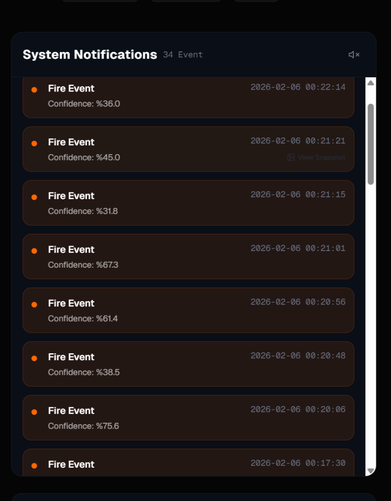
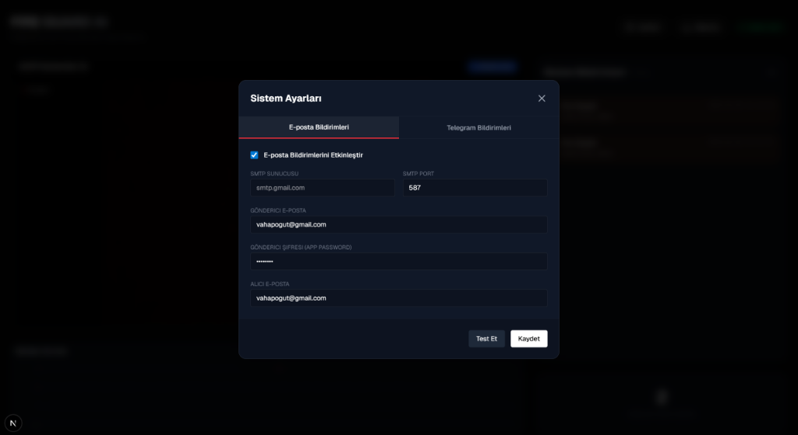
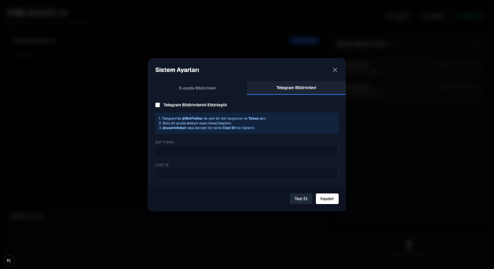
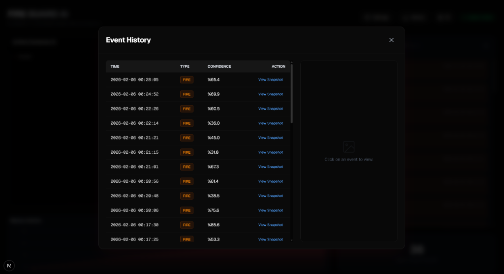

#  Fire Guard AI / Yapay Zeka Yangın Tespit Sistemi

**Fire Guard AI** is an advanced fire and smoke detection system designed to provide 24/7 protection using real-time computer vision and artificial intelligence.

**Fire Guard AI**, gerçek zamanlı görüntü işleme ve yapay zeka kullanarak 7/24 koruma sağlayan ileri seviye bir yangın ve duman tespit sistemidir.

##  Features / Özellikler

###  Dashboard / Kontrol Paneli

*Real-time multi-camera monitoring and event notification panel.*


*   ** Real-Time Detection:** Instant fire and smoke detection using the YOLOv8 AI model.
*   ** Multi-Camera Support:** Monitor unlimited cameras (Webcam, RTSP, IP Camera) simultaneously in a grid view.
*   ** Background Service:** Continuous protection running in the background, even when the web interface is closed.

###  Notification Settings / Bildirim Ayarları
| E-posta Ayarları | Telegram Ayarları |
| :---: | :---: |
|  |  |

###  Event History / Geçmiş Kayıtları

*Detailed list of past events and snapshots.*

*   ** Instant Notifications:**
    *   **Telegram:** Receive real-time photos of the detected event directly to your phone.
    *   **Email:** Detailed incident reports sent to your inbox.
*   ** Stats & History:** Daily/Weekly charts and a searchable archive of past events with snapshots.
*   ** Easy Management:** User-friendly interface to manage cameras and configure notification settings.

##  Tech Stack / Teknolojiler

*   **Backend:** Python, FastAPI, OpenCV, Ultralytics (YOLOv8), SQLite
*   **Frontend:** Next.js, React, Tailwind CSS, Recharts
*   **AI Model:** Custom trained YOLOv8 for Fire & Smoke

##  Installation / Kurulum

Follow these steps to run the project locally. / Projeyi yerel makinenizde çalıştırmak için aşağıdaki adımları izleyin.

### Prerequisites / Ön Gereksinimler
*   Python 3.9+
*   Node.js 18+
*   Git

### 1. Clone the Repository / Projeyi Klonlayın
```bash
git clone https://github.com/vahapogut/AI-fire-detection.git
cd AI-fire-detection
```

### 2. Backend Setup / Backend Kurulumu
The backend handles video processing and AI inference.

```bash
cd backend
# Create virtual environment (Recommended)
python -m venv venv
# Activate on Windows:
venv\Scripts\activate
# Activate on Mac/Linux:
# source venv/bin/activate

# Install dependencies
pip install -r requirements.txt

# Start the server
python main.py
```
*Backend runs at `http://localhost:8000` by default.*
```bash
cd frontend
# Install packages
npm install

# Start the application
npm run dev
```
*Frontend runs at `http://localhost:3000` by default.*

##  Usage / Kullanım

1.  Open `http://localhost:3000` in your browser.
2.  Click **Add Camera** to add a source:
    *   For Webcam: `0` or `1`
    *   For IP Cam: `rtsp://user:password@ip_address:554/stream`
3.  Go to **Settings** to configure Telegram and Email credentials.
4.  The system is now active! It will alert you upon detecting fire or smoke.

##  Contributing / Katkıda Bulunma

1.  Fork this repository.
2.  Create a feature branch (`git checkout -b feature/NewFeature`).
3.  Commit your changes (`git commit -m 'Add new feature'`).
4.  Push to the branch (`git push origin feature/NewFeature`).
5.  Open a Pull Request.

##  License / Lisans

Distributed under the MIT License. See `LICENSE` for more information.

---
*Developer: Abdulvahap Öğüt*
